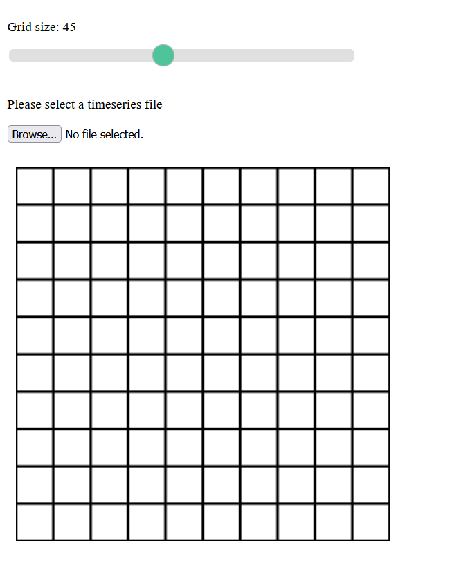

To compile the ScalaJS to Javascript, enter the following commands in the sbt shell.
```
project gui
~fastLinkJS
```
You can find the generated JS files in the folder `GUI/target/scala-2.12/ticktalk-gui-fastopt`.

The `index-dev.html` and `index-dev.css` files define the static components of the visualization. You can view it using a browser.

You can visualize a 2D binary timeseries. We encode the time series with the following schema. 
- The first line is a header that encodes the meta information about how to display the grid. Starting with `#`, the first number defines the number of grids horizontally and the second defines the number of grids vertically, separated by comma. For example. `#3, 2` means to interpret the data as 3x2 grid. 
- Each line represents the global state at a time unit. The global state is the collection of individual states, each represented with a binary 1 or 0. We plot 1 with black and 0 with white. We infer the coordinate of each cell in the 2D grid based on its index in the line. You can change the color scheme or add more resolutions by updating `index-dev.html` and `src/folder/`. 
- A timeseries file with multiple lines represent dynamic timeseries. You can try the example in `experiments/timeseries.txt`. The speed of the frames is defined in `index-dev.html`.

Please adjust the size of the grid cell using the slider before loading the timeseries file.



Once loading the file, you should see cells encoded with different colors.

