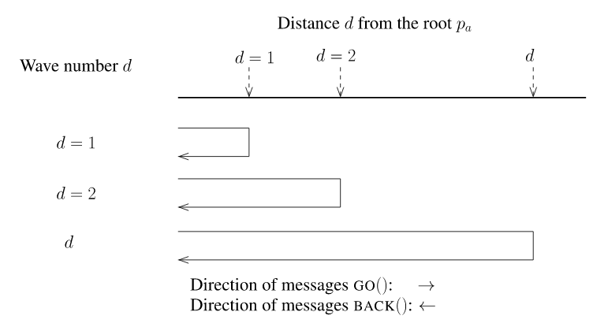

This version shows how we can use BFS to build a spanning tree with centralized control (wave)

Here is a figure from the reference (see [reference](../README.md)) that demonstrates the message pattern when using this scheme. Below is a sample trace; you can see the two-phase pattern of the go and back messages. 



Possible output: 
```
(Time 0.0 Turn 0)
(Time 0.0 Turn 1)
(Time 0.0 Turn 2)
(Time 0.0 Turn 3)
Initialization completed! Neighbors of 1: Set(2, 3)
Initialization completed! Neighbors of 2: Set(1, 3)
Initialization completed! Neighbors of 3: Set(1, 2, 4)
Initialization completed! Neighbors of 4: Set(3)
(Time 0.0 Turn 4)
2 receives go message from 1 level 0
3 receives go message from 1 level 0
(Time 0.0 Turn 5)
1 receives back message from List(2) Response: 2
1 receives back message from List(3) Response: 2
(Time 0.0 Turn 6)
2 receives go message from 1 level 0
3 receives go message from 1 level 0
(Time 0.0 Turn 7)
2 receives go message from 3 level 1
3 receives go message from 2 level 1
4 receives go message from 3 level 1
(Time 0.0 Turn 8)
2 receives back message from List(3) Response: 0
3 receives back message from List(4) Response: 1
3 receives back message from List(2) Response: 0
(Time 0.0 Turn 9)
1 receives back message from List(2) Response: 1
1 receives back message from List(3, 4) Response: 1
Broadcast completed!
(Time 0.0 Turn 10)
...
```