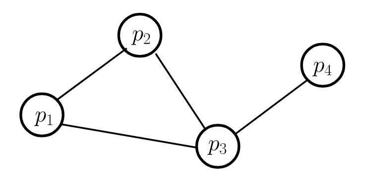

Examples in this folder address **network traversal** in a distributed setting. Reference: "Distributed algorithms for message-passing systems", Chapter 1. 

The graph we used in the examples is visualized below. 

- [Parallel traversal](parallelTraversal) shows an example of parallel traversal in an arbitrary network using broadcast and convergecast. 
- [DFS spanning tree](DFSpanningTree) builds a spanning tree using DFS in a distributed graph, optimized with global knowledge (about what their neighbors know). 
- [BFS spanning tree, decentralized](BFSpanningTree) demonstrates how to build a spanning tree using BFS, without centralized control, i.e. node has insufficient knowledge, unaware of whether its states are final. 
- [BFS spanning tree, centralized](BFSpanningTreeWave) introduces central control to the BFS implementation; comparing to the decentralized alternative, this implementation trades time complexity for better message complexity. 
- [Logical ring](LogicalRing) is an application of the parallel network traversal: it shows how we can build a logical unidirectional ring for a connected network. For more details, please refer to the chapter listed above. 
