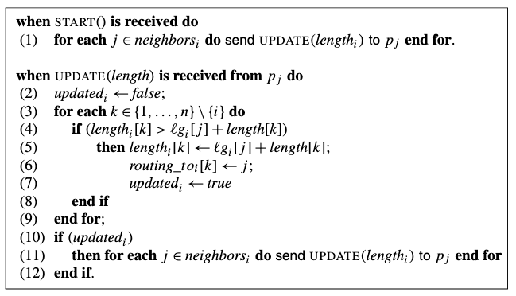

This example implements distributed BellmanFord algorithm over an undirected graph to find shortest path. Note that each node has no knowledge whether its values are final. 

Pseudo code for distributed Bellman-Ford algorithm: 



Sample output: 
```
(Time 0.0 Turn 0)
(Time 0.0 Turn 1)
(Time 0.0 Turn 2)
(Time 0.0 Turn 3)
Neighbors discovered! 
Channel distance to neighbors : Map(2 -> 1, 4 -> 2, 3 -> 5)
Neighbors discovered! 
Channel distance to neighbors : Map(4 -> 1, 1 -> 1, 3 -> 3)
Neighbors discovered! 
Channel distance to neighbors : Map(2 -> 3, 4 -> 1, 1 -> 5)
Neighbors discovered! 
Channel distance to neighbors : Map(2 -> 1, 1 -> 2, 3 -> 1)
(Time 0.0 Turn 4)
1: Lengths: Map(2 -> 2147483647, 4 -> 2147483647, 1 -> 0, 3 -> 2147483647)
2: Lengths: Map(2 -> 0, 4 -> 2147483647, 1 -> 2147483647, 3 -> 2147483647)
3: Lengths: Map(2 -> 2147483647, 4 -> 2147483647, 1 -> 2147483647, 3 -> 0)
4: Lengths: Map(2 -> 2147483647, 4 -> 0, 1 -> 2147483647, 3 -> 2147483647)
(Time 0.0 Turn 5)
1: Lengths: Map(2 -> 2147483647, 4 -> 2147483647, 1 -> 0, 3 -> 2147483647)
2: Lengths: Map(2 -> 0, 4 -> 2147483647, 1 -> 1, 3 -> 2147483647)
3: Lengths: Map(2 -> 2147483647, 4 -> 2147483647, 1 -> 5, 3 -> 0)
4: Lengths: Map(2 -> 2147483647, 4 -> 0, 1 -> 2, 3 -> 2147483647)
(Time 0.0 Turn 6)
1: Lengths: Map(2 -> 1, 4 -> 2, 1 -> 0, 3 -> 5)
2: Lengths: Map(2 -> 0, 4 -> 1, 1 -> 1, 3 -> 3)
3: Lengths: Map(2 -> 3, 4 -> 1, 1 -> 3, 3 -> 0)
4: Lengths: Map(2 -> 1, 4 -> 0, 1 -> 2, 3 -> 1)
(Time 0.0 Turn 7)
1: Lengths: Map(2 -> 1, 4 -> 2, 1 -> 0, 3 -> 3)
2: Lengths: Map(2 -> 0, 4 -> 1, 1 -> 1, 3 -> 2)
3: Lengths: Map(2 -> 2, 4 -> 1, 1 -> 3, 3 -> 0)
4: Lengths: Map(2 -> 1, 4 -> 0, 1 -> 2, 3 -> 1)
(Time 0.0 Turn 8)
1: Lengths: Map(2 -> 1, 4 -> 2, 1 -> 0, 3 -> 3)
2: Lengths: Map(2 -> 0, 4 -> 1, 1 -> 1, 3 -> 2)
3: Lengths: Map(2 -> 2, 4 -> 1, 1 -> 3, 3 -> 0)
4: Lengths: Map(2 -> 1, 4 -> 0, 1 -> 2, 3 -> 1)
(Time 0.0 Turn 9)
1: Lengths: Map(2 -> 1, 4 -> 2, 1 -> 0, 3 -> 3)
2: Lengths: Map(2 -> 0, 4 -> 1, 1 -> 1, 3 -> 2)
3: Lengths: Map(2 -> 2, 4 -> 1, 1 -> 3, 3 -> 0)
4: Lengths: Map(2 -> 1, 4 -> 0, 1 -> 2, 3 -> 1)
... 
```