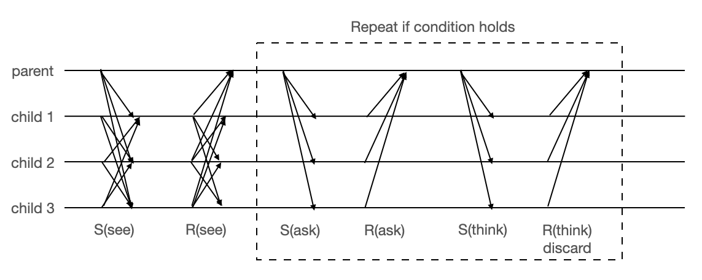

In this version, children hear from the parent whether anyone knows if they are muddy, instead of looking around. The message pattern is shown below. 



Sample output: 
```
(Time 0.0 Turn 0)
(Time 0.0 Turn 1)
(Time 0.0 Turn 2)
(Time 0.0 Turn 3)
There is at least one muddy child.
Speak up if you know whether you are clean or muddy
(Time 0.0 Turn 4)
Child 49 is aware of its status: falsecLogicExampleSpec 0s
Child 50 is aware of its status: false
Child 51 is aware of its status: false
Child 52 is aware of its status: false
(Time 0.0 Turn 5)
(Time 0.0 Turn 6)
(Time 0.0 Turn 7)
(Time 0.0 Turn 8)
(Time 0.0 Turn 9)
There is at least one muddy child.
Speak up if you know whether you are clean or muddy
(Time 0.0 Turn 10)
Child 49 is aware of its status: false
Child 50 is aware of its status: false
Child 51 is aware of its status: false
Child 52 is aware of its status: false
(Time 0.0 Turn 11)
(Time 0.0 Turn 12)
(Time 0.0 Turn 13)
(Time 0.0 Turn 14)
(Time 0.0 Turn 15)
There is at least one muddy child.
Speak up if you know whether you are clean or muddy
(Time 0.0 Turn 16)
Child 49 is aware of its status: true
Child 50 is aware of its status: true
Child 51 is aware of its status: true
Child 52 is aware of its status: false
(Time 0.0 Turn 17)
...
```