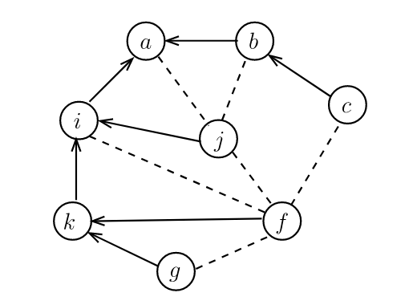

This example demonstrates how we can build a spanning tree from a connected graph and apply broadcasting. It also illustrates one way of doing dependency injection in the simulation framework (through the use of channels). (reference: "Distributed algorithms for message-passing systems", 1.2.4)

Figure below shows the graph we used in the example (from the same reference). 

